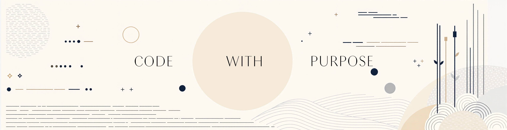

# Hola, soy Gustavo 👋
### Sobre mí

Programador apasionado por la tecnología con experiencia en PHP, JavaScript, HTML y CSS. Me especializo en el desarrollo de soluciones eficientes y bien estructuradas, asegurándome de que cada detalle esté cuidadosamente trabajado. Siempre busco aprender y mejorar mis habilidades para ofrecer resultados de alta calidad.

---

### Tecnologías

  
  
  
  
  
  
  
  
  
  
  
  
  
  
  
  
  
  
  
  
  
  
  

---

### Proyectos destacados

<table>
  <tr>
    <td width="50%">
      <h3 align="center">Alrededor del Mundo</h3>
      

        
        

          Una aplicación web tipo red social llamada "Around The U.S."
        

      

    </td>
    <td width="50%">
      <h3 align="center">Sistema de gestion de empleados</h3>
      

        
        

          Un sistema de Gestion de empleados con funcionalidad de tickets para la resolucion de problemas
        

      

    </td>
  </tr>
</table>

### Estadísticas

  <!-- GitHub Stats en español -->
  

    
  
  

  <!-- Top Languages en español -->
  
  
  <!-- GitHub Streak Stats en español -->
  
  

  

---

### Contacto

  
  
  
  
  

